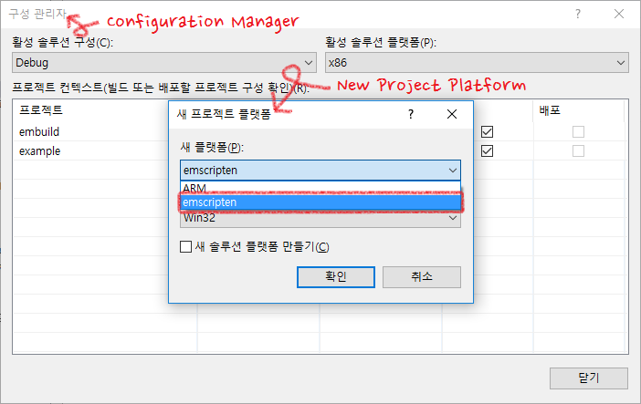

## HELLO! I'M FINE, THANK YOU, AND YOU?

I'm not good at english :(

* It can use emcc like Visual Studio compiler 
* It can NOT debug

Create installer when build project

Installer will generate at "$(SolutionDir)/installer"

Installer action is simple, just copy 'emscripten' directory to MSBuild platform directory

When install is over, you can find new platform!

